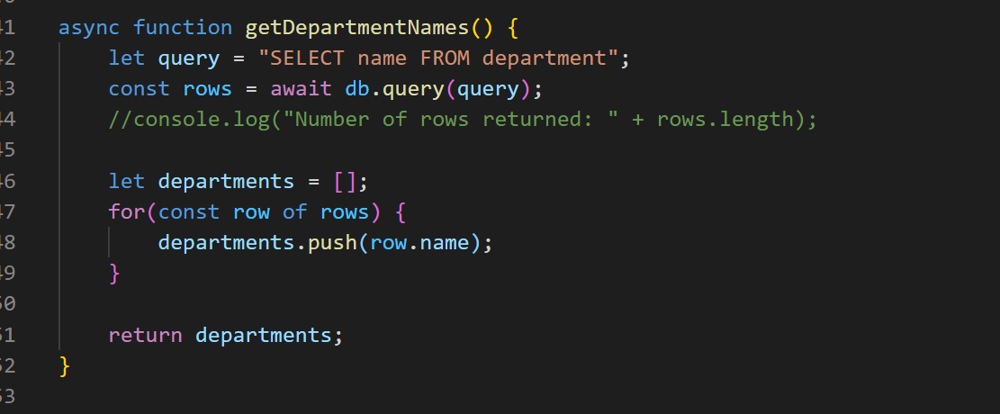
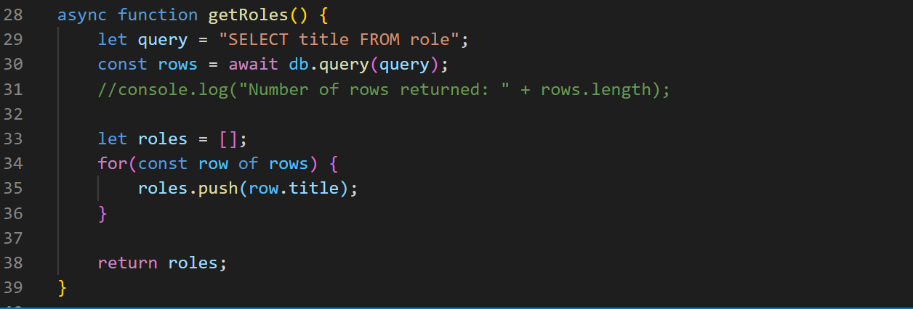
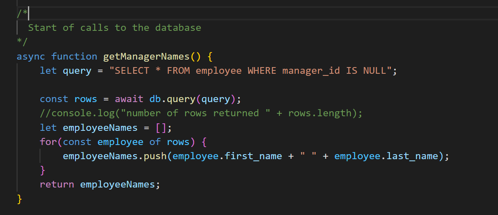

# employee-tracker
  -Developers are often tasked with creating interfaces that make it easy for non-developers to view and interact with information stored in databases. Often these interfaces are known as Content Management Systems. In this homework assignment, your challenge is to architect and build a solution for managing a company's employees using node, inquirer, and MySQL.
  
# Getting Started

1. Download and unzip the code, and install the prerequisites, as explained in the "Installing" section of this README.

2. In your "employee-tracker-master" directory there is a "db" directory. In that directory there are two files: cms.sql and seed.sql. 
    a. Open your MySQL Workbench and run cms.sql to create the database and tables.
    b. Then run seed.sql to populate the database with some data. (Bonus points if you recognize the people in your database.)
    
3. Now that your database is ready to be queried, open index.js and enter your MySQL root password on line 9.

4. Open a Git terminal. Type "node employee_tracker.js"

# Installation 

1. Go to https://github.com/Britt1216/employee-tracker and click on the "Clone or Download" button. 

2. Choose "Download ZIP". 

3. Unzip into a directory. If you're on Windows, open File Explorer and navigate to the download directory. Select the ZIP file, right click, and choose "Extract All". Accept the default location.

4. Once the file is unzipped, navigate to employee-tracker-master.

5. If you don't have the prerequisites installed, type the following:
   * npm install inquirer
   * npm install mysql
   * npm install console-table
   
6. Then use your Git terminal to execute index.js. 

  
# Tables (within the code)

* department:

    -id - INT PRIMARY KEY

    -name - VARCHAR(30) to hold department name
    
     
  
 
 

 

* role:

    -id - INT PRIMARY KEY

    -title -  VARCHAR(30) to hold role title

    -salary -  DECIMAL to hold role salary

    -department_id -  INT to hold reference to department role belongs to

     
  
 
 

 

*  employee:

    -id - INT PRIMARY KEY

    -first_name - VARCHAR(30) to hold employee first name

    -last_name - VARCHAR(30) to hold employee last name

    -role_id - INT to hold reference to role employee has

    -manager_id - INT to hold reference to another employee that manager of the current employee. This field may be null if the employee has no manager

     
  
 
 

 

# Minimun Requirements:

    -Functional application.

    -GitHub repository with a unique name and a README describing the project.

    -The command-line application should allow users to:

    -Add departments, roles, employees

    -View departments, roles, employees

    -Update employee roles

#  Built Using

* [Visual Studio Code] https://code.visualstudio.com/docs/setup/setup-overview
      -[Visual Studio Code Extension "Open in Browser"]
      - Open VS Code.
      - Open the extensions pane and search for open in browser.
      - Select the version written by TechER and click Install.
* Git Terminal (https://git-scm.com/downloads)
* Node (https://nodejs.org/en/download/)
      - inqiurer
* mysql
    - console.table

# Code to link to MySQL

 
  
 
 

 

